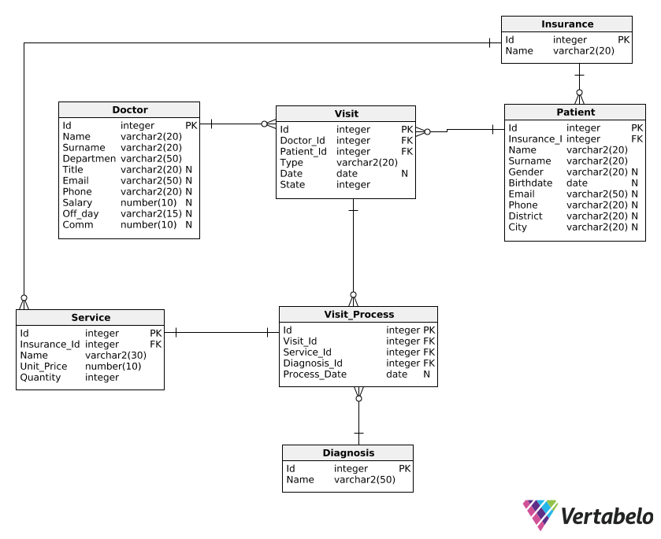

# Medical_Center_Database_Design
PJATK RBD Class Term Project Summer 2020

## 1st phase 
•       Topic description with functional requirements 
•       Entity relationship diagram

## 2nd phase 
•       Complete set of DDL instructions required to create database structure on university Oracle server
•       Complete set of DML instructions required to fill all your tables with data
•       DQL instructions that meet all following requirements:
o   2 SELECT statements that includes at least two tables and contains WHERE clause
o   2 SELECT statements with aggregate functions
o   1 SELECT statement with subquery
o   1 SELECT statement with correlated subquery

## 3rd phase 
•       1 BEFORE statement trigger (for INSERT, UPDATE and DELETE statements) (among them some table triggers, some row triggers)
•       1 AFTER statement trigger (for INSERT, UPDATE and DELETE statements)
•       DML statements showing how above triggers work 
(among them some table triggers, some row triggers)

